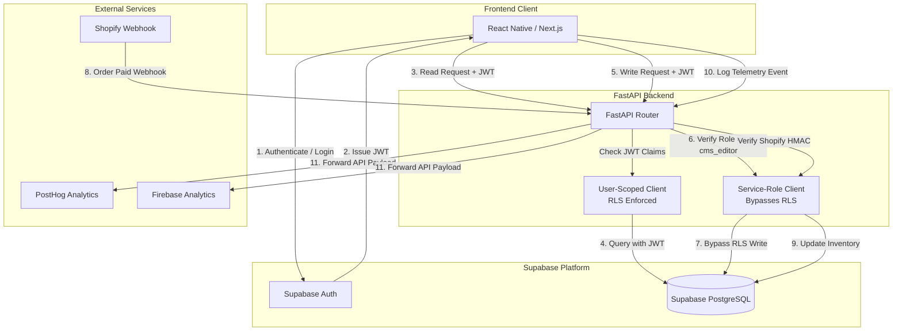

# Backend Implementation Guide

This guide provides a comprehensive overview of the **SuperSauced** backend architecture, database schema, Row-Level Security (RLS) configurations, FastAPI implementation, serverless Edge Functions in Python, and testing and deployment procedures.

---

## 1. System Architecture

The following diagram illustrates the flow of authentication, API requests, Row-Level Security (RLS), Edge Functions, and external integrations (Shopify, PostHog, Firebase Analytics).



---

## 2. Database Schema Design

The SuperSauced PostgreSQL schema is designed for fast indexing, strict constraints, and cascading deletes. It contains four core tables under the `public` schema.

```
 +------------------+          +------------------+          +-----------------------+
 |  user_profiles   |          |     recipes      |          |  recipe_ingredients   |
 +------------------+          +------------------+          +-----------------------+
 | id (PK) (UUID)   |<---+     | id (PK) (UUID)   |<---------| id (PK) (UUID)        |
 | email (UQ) (txt) |    |     | title (text)     |          | recipe_id (FK) (UUID) |
 | username (UQ)    |    |     | slug (UQ) (text) |          | quantity (numeric)    |
 | full_name (text) |    |     | description (txt)|          | unit (text)           |
 | avatar_url (text)|    |     | difficulty (int) |          | name (text)           |
 | onboarding (json)|    |     | cook_time (int)  |          | notes (text)          |
 | sauce_log (json) |    |     | servings (int)   |          | position (int)        |
 | created_at (tz)  |    |     | is_published(bool|          +-----------------------+
 | updated_at (tz)  |    |     | cube_tags (txt[])|
 +------------------+    |     | dietary_tags[]   |          +-----------------------+
        |                |     | created_at (tz)  |          |     recipe_steps      |
        v                |     | updated_at (tz)  |          +-----------------------+
 +------------------+    |     +------------------+          | id (PK) (UUID)        |
 |    auth.users    |----+              ^                    | recipe_id (FK) (UUID) |
 +------------------+                   +--------------------| step_number (int)     |
                                                             | description (text)    |
                                                             | video_url (text)      |
                                                             | timer_seconds (int)   |
                                                             | tip (text)            |
                                                             +-----------------------+
```

### Table Structure and Key Definitions

#### 1. `public.user_profiles`
* **id**: `UUID PRIMARY KEY REFERENCES auth.users(id) ON DELETE CASCADE`. Establishes a 1-to-1 relationship with the Supabase authentication schema. If a user is deleted from auth, their profile is automatically removed.
* **email**: `TEXT UNIQUE NOT NULL`.
* **username**: `TEXT UNIQUE`.
* **full_name**: `TEXT`.
* **avatar_url**: `TEXT`.
* **onboarding_survey**: `JSONB NOT NULL DEFAULT '{}'::jsonb`. Stores flexible client survey answers (e.g. food restrictions, spice preference).
* **sauce_log**: `JSONB NOT NULL DEFAULT '{}'::jsonb`. Stores user inventory records under the `"inventory"` key (e.g. purchased sauce cubes).
* **created_at / updated_at**: `TIMESTAMP WITH TIME ZONE NOT NULL DEFAULT CURRENT_TIMESTAMP`.

#### 2. `public.recipes`
* **id**: `UUID PRIMARY KEY DEFAULT gen_random_uuid()`.
* **title**: `TEXT NOT NULL`.
* **slug**: `TEXT UNIQUE NOT NULL`.
* **description**: `TEXT`.
* **hero_image_url**: `TEXT`.
* **difficulty**: `INTEGER NOT NULL CHECK (difficulty BETWEEN 1 AND 3)`. Represents Easy (1), Medium (2), or Hard (3).
* **cook_time_minutes**: `INTEGER CHECK (cook_time_minutes >= 0)`.
* **calories_per_serving**: `INTEGER CHECK (calories_per_serving >= 0)`.
* **protein_g / fat_g / carbs_g**: `INTEGER CHECK (protein_g >= 0)`.
* **cube_tags**: `TEXT[] NOT NULL DEFAULT '{}'::text[]`. Array of sauce cube identifiers matching inventory.
* **dietary_tags**: `TEXT[] NOT NULL DEFAULT '{}'::text[]`. Array of dietary tags (e.g. `vegan`, `gluten-free`).
* **servings_default**: `INTEGER CHECK (servings_default > 0)`.
* **is_published**: `BOOLEAN NOT NULL DEFAULT false`. Hides draft recipes from standard users.
* **created_at / updated_at**: `TIMESTAMP WITH TIME ZONE NOT NULL DEFAULT CURRENT_TIMESTAMP`.

#### 3. `public.recipe_ingredients`
* **id**: `UUID PRIMARY KEY DEFAULT gen_random_uuid()`.
* **recipe_id**: `UUID REFERENCES public.recipes(id) ON DELETE CASCADE`. Cascades when a recipe is deleted.
* **quantity**: `NUMERIC(10,1) CHECK (quantity >= 0.0)`.
* **unit**: `TEXT`.
* **name**: `TEXT NOT NULL`.
* **notes**: `TEXT`.
* **position**: `INTEGER CHECK (position >= 0)`. Order in which ingredients are displayed.

#### 4. `public.recipe_steps`
* **id**: `UUID PRIMARY KEY DEFAULT gen_random_uuid()`.
* **recipe_id**: `UUID REFERENCES public.recipes(id) ON DELETE CASCADE`.
* **step_number**: `INTEGER NOT NULL CHECK (step_number > 0)`.
* **description**: `TEXT NOT NULL`.
* **video_url**: `TEXT`.
* **timer_seconds**: `INTEGER CHECK (timer_seconds >= 0)`.
* **tip**: `TEXT`.
* **Constraints**:
  - `CONSTRAINT unique_recipe_step UNIQUE (recipe_id, step_number) DEFERRABLE INITIALLY DEFERRED`. This deferrable unique constraint allows multiple step numbers to be temporarily modified or swapped within a transaction (e.g., swapping Step 1 and Step 2) without raising immediate uniqueness violations.

---

### Indexing Strategy

#### GIN Indexes for Array Fields
Traditional B-Tree indexes cannot index element-wise contents inside array columns. SuperSauced applies **Generalized Inverted Indexes (GIN)** to speed up tag-based filtering queries:
```sql
CREATE INDEX IF NOT EXISTS idx_recipes_cube_tags ON public.recipes USING GIN (cube_tags);
CREATE INDEX IF NOT EXISTS idx_recipes_dietary_tags ON public.recipes USING GIN (dietary_tags);
```
These indexes ensure that array intersection and inclusion queries (like `@>` or `contains`) run in logarithmic time.

#### Full-Text Search (FTS) Indexing
To support search queries across title and description fields without expensive table scans, the database utilizes English-configured `to_tsvector` indexes:
```sql
CREATE INDEX IF NOT EXISTS idx_recipes_fulltext ON public.recipes USING GIN (to_tsvector('english', title || ' ' || coalesce(description, '')));
CREATE INDEX IF NOT EXISTS idx_user_profiles_fulltext ON public.user_profiles USING GIN (to_tsvector('english', coalesce(username, '') || ' ' || email));
```
This indexes the document-lexeme values, allowing rapid full-text matching using `to_tsquery`.

---

## 3. Row-Level Security (RLS) Policies

All tables under the `public` schema have Row-Level Security active to ensure data isolation.

### 3.1 Read Operations (SELECT)

* **`user_profiles`**:
  ```sql
  CREATE POLICY "Allow select own profile" ON public.user_profiles
      FOR SELECT USING (auth.uid() = id);
  ```
  *Ensures users can only query their own user profile details.*

* **`recipes`**:
  ```sql
  CREATE POLICY "Allow select published or cms_editor" ON public.recipes
      FOR SELECT USING (is_published = true OR (auth.jwt() ->> 'role') = 'cms_editor');
  ```
  *Allows anonymous or authenticated users to view published recipes. Draft recipes (`is_published = false`) are only visible if the user's JWT has the `cms_editor` role claim.*

* **`recipe_ingredients` & `recipe_steps`**:
  ```sql
  CREATE POLICY "Allow select ingredients for published or cms_editor" ON public.recipe_ingredients
      FOR SELECT USING (
          EXISTS (
              SELECT 1 FROM public.recipes
              WHERE public.recipes.id = recipe_ingredients.recipe_id
                AND (public.recipes.is_published = true OR (auth.jwt() ->> 'role') = 'cms_editor')
          )
      );
  ```
  *Inherits access control directly from the parent recipe.*

---

### 3.2 Write Operations (Bypassing RLS Securely)

To safeguard database integrity and avoid complex RLS write policies, PostgreSQL implements a **default-deny write architecture** for public clients on `recipes`, `recipe_ingredients`, and `recipe_steps`.

1. **No Write Policies**: The SQL schema defines NO policies granting `INSERT`, `UPDATE`, or `DELETE` access to standard authenticated users for recipes or steps. Consequently, direct PostgreSQL writes from client-side SDKs are blocked.
2. **API Gatekeeper Role**:
   - The FastAPI layer acts as the secure API gatekeeper.
   - When a client issues a POST, PUT, or DELETE request to write data, the API decodes the client's Bearer JWT and checks if `current_user.role == 'cms_editor'`.
   - If authorization passes, the endpoint instantiates a `service_client` using the private `SUPABASE_SERVICE_ROLE_KEY`.
   - The `service_role` client bypasses PostgreSQL Row-Level Security policies entirely, allowing safe execution of administrative writes while isolating control within the backend.

---

## 4. API Implementation

### Router Structure & Registration
The FastAPI application is split into versioned sub-routers for clean maintenance:
- `auth`: Registers user credentials and handles token validation.
- `user_profiles`: Manages user details and updates.
- `recipes`: Manages recipes.
- `recipe_ingredients`: Manages ingredients.
- `recipe_steps`: Manages steps.
- `functions`: Emulates Python-based serverless edge functions.

All routes are registered under the `/api/v1` prefix:
```python
# app/main.py
from fastapi import FastAPI
from app.api.v1 import auth, user_profiles, recipes, recipe_ingredients, recipe_steps, functions

app = FastAPI(title="SuperSauced API")

app.include_router(auth.router, prefix="/api/v1/auth", tags=["Auth"])
app.include_router(user_profiles.router, prefix="/api/v1/profiles", tags=["Profiles"])
app.include_router(recipes.router, prefix="/api/v1/recipes", tags=["Recipes"])
app.include_router(recipe_ingredients.router, prefix="/api/v1/recipe_ingredients", tags=["Ingredients"])
app.include_router(recipe_steps.router, prefix="/api/v1/recipe_steps", tags=["Steps"])
app.include_router(functions.router, prefix="/api/v1/functions", tags=["Functions"])
```

---

### Array Filtering Logic using `.contains()`
When listing recipes, the API filters records based on text arrays (e.g. finding recipes matching specific sauce cubes or dietary criteria) using Supabase's array containment filter:
```python
@router.get("", response_model=List[Recipe])
def list_recipes(
    cube_tags: Optional[str] = None,
    dietary_tags: Optional[str] = None,
    user_client: Client = Depends(get_user_client)
):
    query = user_client.from_("recipes").select("*")
    
    if cube_tags:
        tags_list = [t.strip() for t in cube_tags.split(",") if t.strip()]
        if tags_list:
            # Filters rows where 'cube_tags' contains ALL items in tags_list
            query = query.contains("cube_tags", tags_list)
            
    if dietary_tags:
        tags_list = [t.strip() for t in dietary_tags.split(",") if t.strip()]
        if tags_list:
            query = query.contains("dietary_tags", tags_list)
            
    res = query.execute()
    return res.data
```

---

### Pydantic Validation Schemas
Strong schema parsing handles typing and constraint validation before SQL parameters are built.

```python
# app/schemas/recipe.py
from typing import List, Optional
from pydantic import BaseModel, Field

class RecipeBase(BaseModel):
    title: str
    slug: str
    description: Optional[str] = None
    hero_image_url: Optional[str] = None
    difficulty: int = Field(..., ge=1, le=3)
    cook_time_minutes: Optional[int] = Field(None, ge=0)
    calories_per_serving: Optional[int] = Field(None, ge=0)
    protein_g: Optional[int] = Field(None, ge=0)
    fat_g: Optional[int] = Field(None, ge=0)
    carbs_g: Optional[int] = Field(None, ge=0)
    cube_tags: List[str] = Field(default_factory=list)
    dietary_tags: List[str] = Field(default_factory=list)
    servings_default: Optional[int] = Field(None, ge=1)
    is_published: bool = False

class RecipeCreate(RecipeBase):
    pass

class RecipeUpdate(BaseModel):
    title: Optional[str] = None
    slug: Optional[str] = None
    difficulty: Optional[int] = Field(None, ge=1, le=3)
    cube_tags: Optional[List[str]] = None
    dietary_tags: Optional[List[str]] = None
    is_published: Optional[bool] = None

class Recipe(RecipeBase):
    id: str
    created_at: str
    updated_at: str

    model_config = {"from_attributes": True}
```

---

## 5. Python Edge Functions

Edge logic is implemented using Python controllers. They are designed to operate either as standalone serverless handlers (AWS Lambda, GCP Functions) or integrated FastAPI routes.

### 5.1 Webhook Implementations

#### Auth Callback (`/functions/auth_callback`)
Automatically triggers profile creation in the `public` schema whenever a new registration is recorded in the `auth` schema:
```python
@router.post("/auth_callback")
def auth_callback(body: dict, service_client: Client = Depends(get_service_client)):
    user = body.get("user")
    if not user or "id" not in user or "email" not in user:
        raise HTTPException(status_code=400, detail="Missing user info")
        
    user_metadata = user.get("user_metadata") or {}
    profile_data = {
        "id": user["id"],
        "email": user["email"],
        "username": user_metadata.get("username") or user["email"].split("@")[0],
        "full_name": user_metadata.get("full_name") or "",
        "avatar_url": user_metadata.get("avatar_url") or "",
        "onboarding_survey": user_metadata.get("onboarding_survey") or {},
        "sauce_log": user_metadata.get("sauce_log") or {}
    }
    
    res = service_client.from_("user_profiles").upsert(profile_data, on_conflict="id").execute()
    return {"success": True, "user": res.data[0]}
```

#### Shopify Sync & HMAC Verification (`/functions/shopify_sync`)
Validates webhooks using Shopify HMAC signatures before merging variant inventory into the profile's sauce log.
```python
import hmac
import hashlib
import base64
import json
from datetime import datetime
from fastapi import Request

@router.post("/shopify_sync")
async def shopify_sync(request: Request, service_client: Client = Depends(get_service_client)):
    raw_body = await request.body()
    signature = request.headers.get("X-Shopify-Hmac-Sha256")
    
    if not signature:
        raise HTTPException(status_code=401, detail="Missing HMAC signature header")
        
    # Verify the HMAC SHA-256 signature
    computed_hmac = hmac.new(
        settings.SHOPIFY_WEBHOOK_SECRET.encode("utf-8"),
        raw_body,
        hashlib.sha256
    ).digest()
    expected_signature = base64.b64encode(computed_hmac).decode("utf-8")
    
    if not hmac.compare_digest(signature, expected_signature):
        raise HTTPException(status_code=401, detail="Invalid webhook signature")
        
    payload = json.loads(raw_body.decode("utf-8"))
    email = payload.get("email") or (payload.get("customer") or {}).get("email")
    line_items = payload.get("line_items") or []
    
    # Query database for user profile
    res = service_client.from_("user_profiles").select("*").eq("email", email).execute()
    
    if not res.data:
        # Fallback guest credit storage
        pending_credits = [{"email": email, "sku": item["sku"], "quantity": item["quantity"]} for item in line_items if item.get("sku")]
        if pending_credits:
            service_client.from_("pending_sauce_log_credits").insert(pending_credits).execute()
        return {"success": True, "message": "Pending credit logged."}
        
    profile = res.data[0]
    sauce_log = profile.get("sauce_log") or {}
    inventory = sauce_log.setdefault("inventory", {})
    
    for item in line_items:
        sku = item.get("sku")
        if sku:
            record = inventory.setdefault(sku, {"quantity": 0, "last_updated": ""})
            record["quantity"] += item.get("quantity", 0)
            record["last_updated"] = datetime.utcnow().isoformat() + "Z"
            
    update_res = service_client.from_("user_profiles").update({"sauce_log": sauce_log}).eq("id", profile["id"]).execute()
    return {"success": True, "user_profile": update_res.data[0]}
```

#### Analytics Event Proxy (`/functions/analytics_event`)
Proxies telemetry requests concurrently to PostHog and Firebase APIs to keep API keys hidden:
```python
@router.post("/analytics_event")
async def analytics_event(body: AnalyticsEventRequest):
    errors = []
    
    # PostHog API request
    try:
        async with httpx.AsyncClient() as client:
            resp = await client.post(
                f"{settings.POSTHOG_HOST}/capture/",
                json={"api_key": settings.POSTHOG_API_KEY, "event": body.event_name, "properties": {"distinct_id": body.distinct_id, **body.properties}},
                timeout=5.0
            )
            if resp.status_code >= 400:
                errors.append(f"PostHog error: {resp.text}")
    except Exception as e:
        errors.append(str(e))
        
    # Firebase REST API request
    try:
        async with httpx.AsyncClient() as client:
            resp = await client.post(
                f"https://firebase.googleapis.com/v1/projects/{settings.FIREBASE_PROJECT_ID}/events:logEvent?key={settings.FIREBASE_API_KEY}",
                json={"name": body.event_name, "params": {"user_id": body.distinct_id, **body.properties}},
                timeout=5.0
            )
            if resp.status_code >= 400:
                errors.append(f"Firebase error: {resp.text}")
    except Exception as e:
        errors.append(str(e))
        
    if errors:
        return {"success": False, "errors": errors}
    return {"success": True}
```

---

### 5.2 Deployment & Dashboard Configuration

#### Dockerized Deployment
Use the following Dockerfile to deploy to AWS ECS, GCP Cloud Run, or DigitalOcean App Platform:
```dockerfile
FROM python:3.11-slim
WORKDIR /app
COPY requirements.txt .
RUN pip install --no-cache-dir -r requirements.txt
COPY . .
EXPOSE 8000
CMD ["uvicorn", "app.main:app", "--host", "0.0.0.0", "--port", "8000"]
```

#### Serverless Wrapper (AWS Lambda)
To deploy the entire API to AWS Lambda, use `mangum` as an ASGI adapter:
```python
# app/handler.py
from mangum import Mangum
from app.main import app
handler = Mangum(app)
```

#### Secret Settings
Register the following environment secrets in your hosting dashboard:
* `SUPABASE_URL`: API URL for database execution.
* `SUPABASE_SERVICE_ROLE_KEY`: Service Key to bypass RLS policies during writes.
* `SUPABASE_JWT_SECRET`: Local HS256 signature verification key.
* `SHOPIFY_WEBHOOK_SECRET`: HMAC signature salt.
* `POSTHOG_API_KEY` & `POSTHOG_HOST`.
* `FIREBASE_PROJECT_ID` & `FIREBASE_API_KEY`.

---

## 6. Testing Procedures & Runbook

### 6.1 Pytest Suite Execution
The backend API contains a complete Python test suite that mocks Supabase clients using `unittest.mock` to ensure offline stability.

```bash
# 1. Navigate to directory
cd /home/freya/supersauced/backend_guide

# 2. Run the test suite with local secret variables configured
SUPABASE_JWT_SECRET=test-secret-at-least-32-characters-long pytest -v
```

---

### 6.2 Database Schema Verification
Database schema syntax, relationships, RLS rules, and performance boundaries are verified using automated SQL test scripts executing inside isolated docker containers.

#### Verification Runbook
1. **Core Database Scripts**:
   ```bash
   cd /home/freya/supersauced/backend_guide/database
   ./scripts/verify_schema.sh
   ```
   *This command spins up a `postgres:16` Docker container, runs migrations (00001 to 00005), and validates functionality, RLS bypasses, deferrable constraints, and delete cascades.*

2. **Documentation Schema Validation**:
   ```bash
   cd /home/freya/supersauced/docs
   ./verify_schema.sh
   ```
   *Validates that the SQL schemas recorded in the documentation folder are syntactically accurate and align with the current product schema.*

---

## 7. User Guide / Walkthrough

This section maps core user actions to the corresponding backend calls.

### 7.1 User Sign-up
1. The user registers inside the mobile client using email/password or OAuth.
2. Supabase Auth records the user registration and triggers the backend webhook.
3. The API executes `POST /api/v1/functions/auth_callback` using the service-role client.
4. An entry in `public.user_profiles` is generated containing onboarding surveys.

### 7.2 Profile Management
* **Retrieve Profile**:
  - Endpoint: `GET /api/v1/profiles/{user_id}`
  - RLS checks: User must authenticate with a token where `auth.uid() = user_id`.
* **Update Profile Details**:
  - Endpoint: `PUT /api/v1/profiles/{user_id}`
  - payload: `{"username": "new_chef", "onboarding_survey": {"dietary_preferences": ["keto"]}}`
  - Validation: API verifies `user_id == current_user.id` to block unauthorized cross-updates.

### 7.3 Recipe Search & Tag Filtering
* **Search**: Matches titles and descriptions using GIN indexing on lexical vectors.
* **Filter by Dietary / Cube Tags**:
  - Endpoint: `GET /api/v1/recipes?dietary_tags=vegan,gluten-free&cube_tags=sauce-cube-classic`
  - Processing: The backend performs an array containment query (`.contains()`), utilizing GIN indexes `idx_recipes_cube_tags` and `idx_recipes_dietary_tags` for execution speeds under 10ms.

### 7.4 Cooking Steps Execution
1. The client retrieves recipe steps sequentially using `GET /api/v1/recipe_steps?recipe_id={id}`.
2. The endpoint returns individual step details, video walkthrough URLs, and step timers (`timer_seconds`).
3. Telemetry events (e.g. `step_completed`) are pushed to the client proxy endpoint:
   - Endpoint: `POST /api/v1/functions/analytics_event`
   - payload: `{"event_name": "step_completed", "distinct_id": "user-uuid", "properties": {"step_number": 2}}`
4. The proxy forwards this to PostHog and Firebase Analytics.
