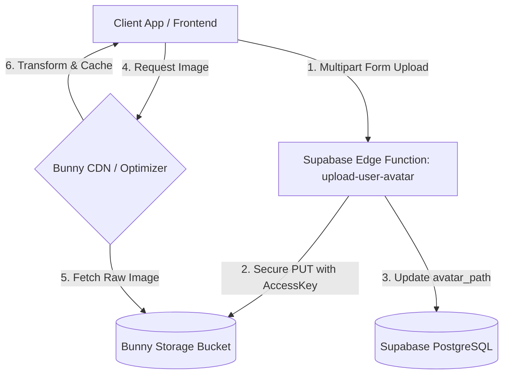

# Bunny.net Integration (Bunny Storage & Bunny Optimizer)

## Overview

This document describes how we integrate **Bunny.net** (Bunny Storage + Bunny Optimizer) in the Super Sauced backend and frontend to deliver optimized media assets (such as user avatars, recipe step media, and product assets) with minimal latency and reduced bandwidth costs.

By replacing Cloudinary with Bunny.net, we have dropped the relational `media_assets` table and transitioned to storing direct paths in relational tables (e.g., `avatar_path`, `file_path`).

## Architecture & Data Flow



1. **Uploads**: Client uploads an avatar image via the `upload-user-avatar` Supabase Edge Function.
2. **Secure Store**: The Edge Function authenticates the user's Supabase JWT, reads the binary data, and performs a secure `PUT` request to Bunny Storage via its private API key.
3. **Database Update**: The Edge Function updates the `avatar_path` column in `public.user_profiles` using the Supabase Service Role client (bypassing RLS).
4. **Delivery**: The client requests the image using a URL returned by `getBunnyImageUrl(path, width)`. The Bunny Pull Zone CDN serves the asset, and Bunny Optimizer automatically resizes, crops, and optimizes it on the fly.

---

## 1. Database Schema

The `media_assets` table has been decommissioned. In its place, direct relative path columns have been established:

- `public.user_profiles`: `avatar_path VARCHAR(255)` (replaces `avatar_media_id`)
- `public.product_media`: `file_path VARCHAR(255)` (replaces `media_id`)
- `public.step_media`: `file_path VARCHAR(255)` (replaces `media_id`)

All migrations apply cleanly via our custom migration file `20240703_bunny_media.sql`.

---

## 2. Frontend Image Utility (`bunny_utility.ts`)

We provide a frontend TypeScript utility to resolve and optimize BunnyCDN paths on the client-side:

```typescript
export function getBunnyImageUrl(path: string, width?: number): string {
  let pullZoneUrl = process.env.NEXT_PUBLIC_BUNNY_URL || "https://supersauced.b-cdn.net";
  
  const base = pullZoneUrl.endsWith("/") ? pullZoneUrl.slice(0, -1) : pullZoneUrl;
  const cleanPath = path.startsWith("/") ? path : `/${path}`;
  const fullUrl = `${base}${cleanPath}`;

  if (width !== undefined && width > 0) {
    // Appends Bunny Optimizer parameters for real-time resizing and format caching
    return `${fullUrl}?width=${width}&aspect_ratio=1:1`;
  }

  return fullUrl;
}
```

---

## 3. Supabase Edge Function: `upload-user-avatar`

Because Bunny.net storage API keys must never be exposed to the client, the `upload-user-avatar` Supabase Edge Function manages the upload process securely.

### Environment Secrets Required

Before deploying, make sure you configure these in your Supabase environment:

```bash
# Set in Supabase Dashboard or via CLI:
supabase secrets set BUNNY_STORAGE_API_KEY="your-storage-api-key"
supabase secrets set BUNNY_STORAGE_ZONE="your-storage-zone-name"
supabase secrets set BUNNY_STORAGE_REGION="de" # ny, sg, etc.
```

### Flow Details

- **Path Schema**: Assets are uploaded to `/users/avatars/{user_id}.jpg`.
- **JWT Verification**: The function validates the Bearer token using standard HS256 signature verification matching your project's JWT Secret.
- **Service Role Database Write**: Updates are committed safely to Postgres using the Supabase Service Role client, bypassing Row Level Security.

---

## 4. Directus CMS Integration Configuration

For Directus CMS to write directly to Bunny Storage, add the S3-compatible configuration to Directus' `.env` settings. See [directus_bunny.env](file:///home/freya/supersauced/directus_bunny.env) for full options:

```env
STORAGE_LOCATIONS="bunny"
STORAGE_BUNNY_DRIVER="s3"
STORAGE_BUNNY_KEY="supersauced" # Your storage zone name
STORAGE_BUNNY_SECRET="your-bunny-storage-api-key-or-password"
STORAGE_BUNNY_BUCKET="supersauced"
STORAGE_BUNNY_ENDPOINT="https://s3.bunnycdn.com"
STORAGE_BUNNY_REGION="de"
STORAGE_BUNNY_PUBLIC_ASSET_URL="https://supersauced.b-cdn.net"
```
